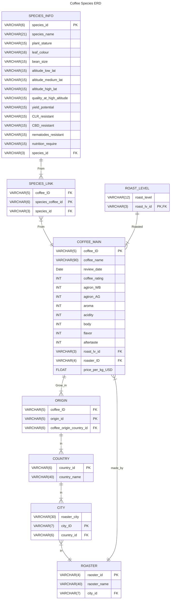

# Top Quality Coffee Bean Production Chain
---
## Project Summary
This project was investigating the selection of coffee beans and their production chain in the top quality coffee blends. To understand the coffee plant variants and properities of top quality coffee blends, the data was mined from world coffee search and coffee review institute. The top quality coffee rated by coffee review stated that more than 60% of top quality coffee are medium-light level. Most of the top quality selected the Geisha variants, followed by Bourbon and Typcia variants in their coffee blend. Moreover, aprroximately 25% of the coffee blend selected Ethiopia-grown coffee beans. This might because the average altitude in Ethiopia is higher than other countries and the altitude of coffee plants growth will highly influence the coffee bean quality.

---

### Collecting data from website (web scaping)

<b>Programming language and package used:</b> Python (BeautifulSoup and request)  
Data from this project was collected from two different coffee organization [World Coffee Research](https://worldcoffeeresearch.org) and [Coffee Review](https://www.coffeereview.com/). Different Arabica coffee varianties information was scraped using [coffee_varieties_worldcoffeeresearch](https://github.com/wingylui/Self-project_Coffee/blob/main/web_scaping/coffee_varieties_worldcoffeeresearch.ipynb); the top quality coffee bean information was scraped using [top_rated_coffee_coffeereview] (https://github.com/wingylui/Self-project_Coffee/blob/main/web_scaping/top_rated_coffee_coffeereview.ipynb). All the information from these two websites was scraped by using requests and BeautifulSoup, and re-organised into Pandas dataframe format, which then exported as a CSV file.

### Cleaning and transforming data

<b>Programming language and package used:</b> Python (Pandas, numpy and geopy)  
Cleaning and transforming data was done in [coffee_review_data_cleaning](https://github.com/wingylui/Self-project_Coffee/blob/main/coffee_review_data_cleaning.ipynb). The top quality coffee bean data was unstructured and unorganised. Hence, the output file from web scaping was firstly modified in excel to ensure all information is in a conventional pattern. The semi-cleaned coffee bean data was then imported into python for identifying arabica variants name within a paragraph. To ensure most variants name is extracted, different name from the same species was searched and replaced it as the offical variant name stated in world coffee research. Moreover, geopy was used to search the country name to ensure the dataset is providing accurate country name.  

The data was then transformed into mulitple tables for storing in PostregSQL database. The database layout was firstly designed and mapped in entity relationship diagram showed as below. All the primary keys were generated and imported into all the nine tables and merged them according to the foregin keys. The nine cleaned csv files were stored in [cleaned_csv file](https://github.com/wingylui/Self-project_Coffee/tree/main/cleaned_csv).  

<b>Coffee Bean Entity Relationship Diagram:</b> 

### Creating Database and Query required information

<b>Progrmaming language and package used:</b> SQL (PostgreSQL) 
All nine tables were created using the script in [create_table](https://github.com/wingylui/Self-project_Coffee/blob/main/PostgreSQL/create_table.sql) with all the format types, primary and foreign keys labelled. After confirming all the csv files are loaded probably, the required data was extracted [(Script)](https://github.com/wingylui/Self-project_Coffee/blob/main/PostgreSQL/obtain_required_data.sql) and stored in [output_csv file](https://github.com/wingylui/Self-project_Coffee/tree/main/PostgreSQL/output_CSV).

### Data Visualisation 

<b>Data Visualization Tools:</b> PowerBI 
The three csv files were imported and merged in PowerBI. A dashboard was created in PowerBI for data visualization.  

PowerBI visualisation example:

---
## References:
- [World Coffee Research](https://worldcoffeeresearch.org)
- [Coffee Review](https://www.coffeereview.com/)
